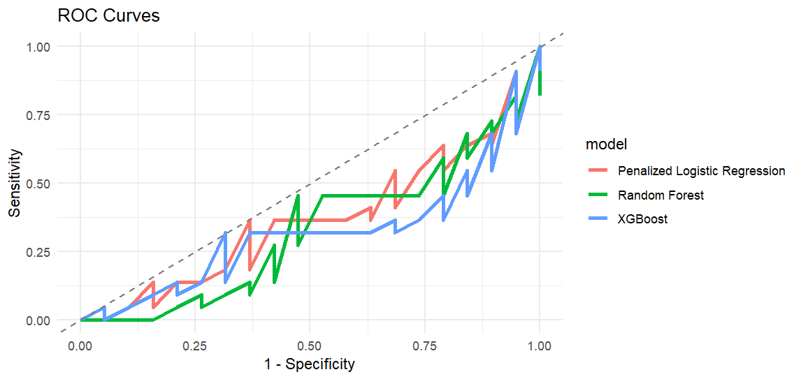
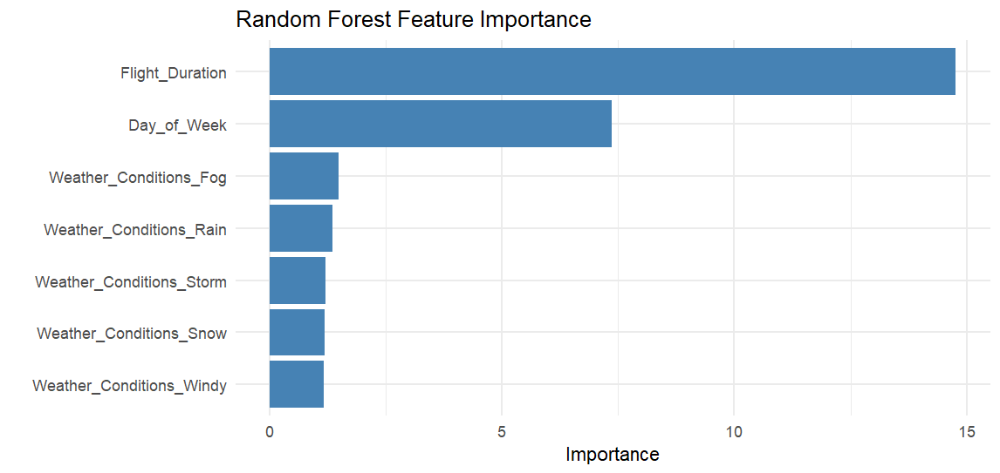
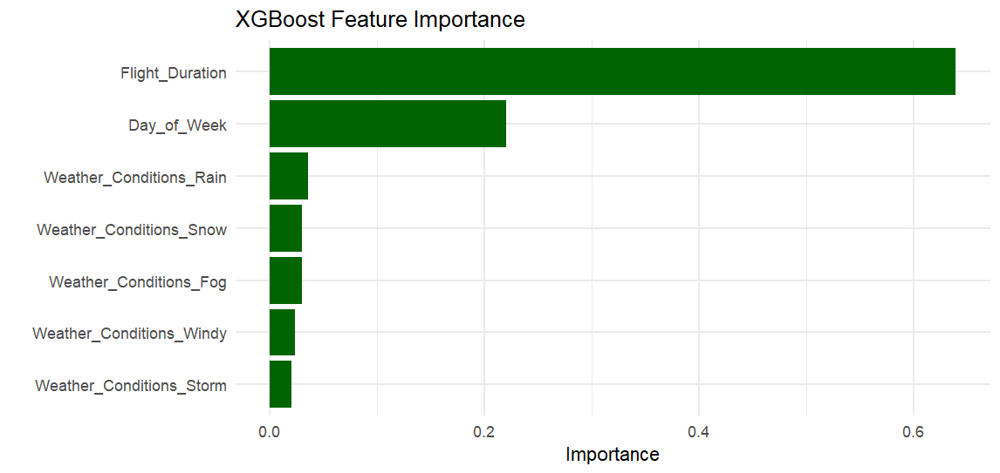
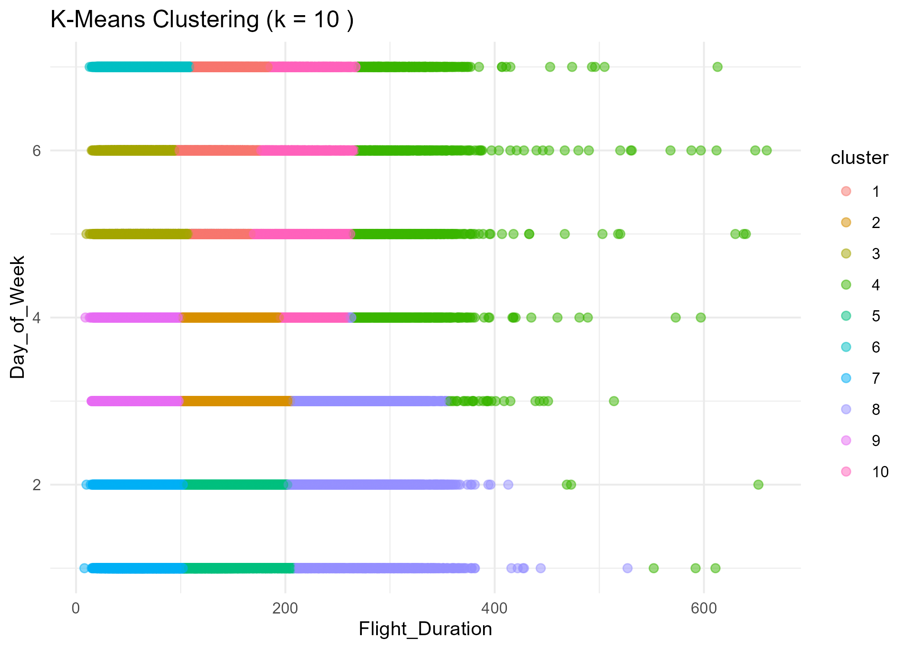

# ✈️ Flight Delay Analysis: Classification & Clustering


## 🔍 Overview

This project analyzes flight delay data using classification and clustering techniques. It builds predictive models to identify delayed flights and uses unsupervised learning to discover patterns in flight behavior.

---

## 🧠 Classification Pipeline

### Models Used:
- Penalized Logistic Regression
- Random Forest
- XGBoost

### Features:
- `Flight_Duration`, `Day_of_Week`, `Weather_Conditions`
- One-hot encoding + normalization
- Class balancing via SMOTE
- ROC curves, AUC, confusion matrices for evaluation
- Feature importance plots

### 🧪 Sample Predictions
Manually simulated flights demonstrate model behavior across conditions (e.g., clear vs stormy weather). The model responds logically — predicting higher delay chances during storms and long durations.

## 📊 Visualizations

## 📊 Visualizations

### ROC Curve


### Random Forest: Feature Importance


### XGBoost: Feature Importance


### K-Means Clustering



---

## 📊 Clustering Analysis

K-Means clustering on `Flight_Duration` and `Day_of_Week` with automatic `k` selection using the elbow method. Clusters reveal natural flight behavior groupings.

---

## 📂 Data

The dataset `flights_200.csv` contains 200 flight records with information such as duration, airline, scheduled departure, and delay status.

---

## 🧰 Requirements

- R (version ≥ 4.0)
- Required packages:

```r
install.packages(c("tidymodels", "tidyverse", "xgboost", "ranger", "themis", "vip", "doParallel"))
🚀 How to Run
Open the R script or R project.

Ensure flights_200.csv is in your working directory.

Run the script to train models and generate visualizations.

View outputs including ROC curves, feature importance, and clustering results.

📎 Full Report
📄 [Download the full DOCX report](reports/Flight-Prediction-Report.docx)

📄 [View the PDF version](reports/Flight-Prediction-Report.pdf)

📜 License
This project is licensed under the MIT License. See the LICENSE file for details.

👤 Author
Oklogo Samuel
GitHub: @Samhanzy
